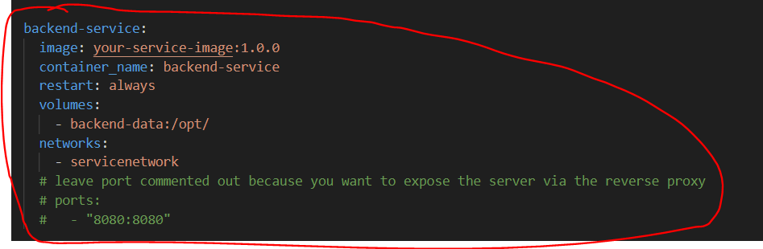
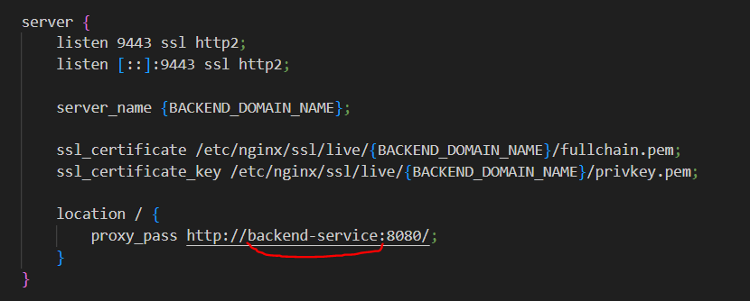
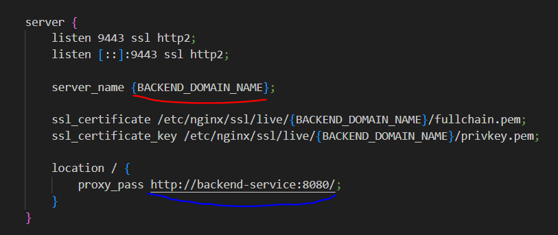
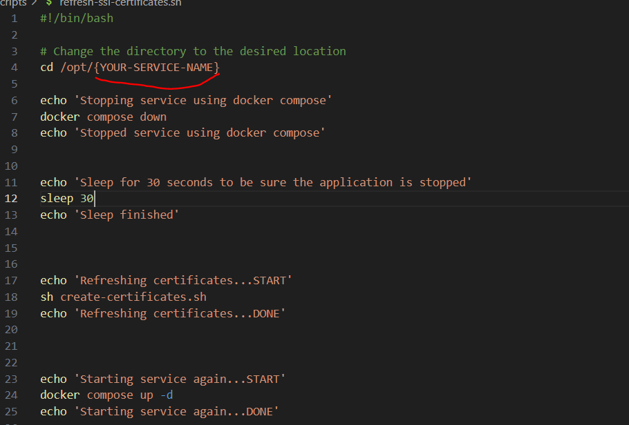

# A Complete Guide to Configuring a Reverse Proxy with Automatic SSL Certificate Renewal on Docker

This project demonstrates how to set up an NGINX reverse proxy using Docker. Let's Encrypt will be used as the server to generate SSL certificates. This configuration ensures secure connections by automating certificate renewal and updates, making it an ideal solution for hosting modern web applications.

The primary focus of this project is to serve as a comprehensive guide to configuring a reverse proxy for web applications, with a robust mechanism for SSL/TLS certificate management. The reverse proxy handles incoming requests, routing them to appropriate services, while providing HTTPS encryption for secure communication. This guide is based on Docker installed on Ubuntu 22.04.

Additionally, the guide includes detailed steps for automating SSL certificate renewal using Certbot, ensuring certificates are updated before expiration. The project outlines best practices for setting up cron jobs or systemd timers to maintain uninterrupted secure connections. This solution ensures ease of management, high security, and reliability for your Dockerized services.

## Prerequisites

Before beginning, ensure your development environment has the following installed:
- **Docker**: Required to containerize and run the reverse proxy.
- **Docker Compose**: Facilitates the configuration of multi-container applications.
- **A Domain Name**: Required for obtaining SSL/TLS certificates.
- **A valid email address**: Required for obtaining SSL/TLS certificates using Let's Encrypt.

## Certificate Creation Configuration

To configure the service, you need to have **Docker** and **Docker Compose** installed. Follow the official guide at https://docs.docker.com/engine/install/. Once Docker is installed, ensure that the domain used to register the certificate points to the IP of the machine where the reverse proxy will be executed. Let's Encrypt does not support SSL/TLS certificates for IP addresses, so you will need a registered public domain. You will also need an email address to receive notifications about certificate expiration from Let's Encrypt. Let's Encrypt is a free service based on donations, so consider donating if your company can afford it.

### Download the files and save them in the installation directory

At this point, it is recommended to create a directory where you can download the files present in the 'scripts' folder of this repository into the /opt/YOUR-SERVICE-NAME directory on your server.

Note: From now on, '/opt/YOUR-SERVICE-NAME' will be considered the directory where the files will be saved.

### Edit the create-certificates.sh file

Now, modify the `create-certificates.sh` file by replacing the placeholders with the correct values:
- Replace `{ADD_YOUR_EMAIL_ADDRESS}` with your email address, e.g., info@company-example.com
- Replace `{ADD_YOUR_DOMAIN_ADDRESS}` with your domain, e.g., app.example.com

Save the file.

### docker-compose-certs.yml

If there are no special requirements, it is recommended to leave the `docker-compose-certs.yml` file as it is without modifying it. If it is necessary to change port 8084 because it is already occupied in your Docker instance, remember to change it in the next step as well.

### Modify the /nginx_rev_proxy/conf/nginx-for-certbot.conf file

If you changed port 8084 in the previous step, proceed to modify it in this file as well. Then, replace the `{BACKEND_DOMAIN_NAME}` value with the domain registered in the DNS.

### Modify firewall rules to allow traffic on ports 80 and 443

Depending on the firewall you are using, you will need to open ports 80 and 443. This depends on the firewall you have installed, but if you are using Ubuntu, there should be the Unified Firewall, and you can use the following instructions.

You can check the open ports on the firewall with the following command:

```sh
sudo ufw status numbered
```

If ports 80 or 443 are closed, you can open them with the following commands:

```sh
sudo ufw allow 80/tcp
sudo ufw allow 443/tcp
```

To apply the changes, use the following command:

```sh
sudo ufw reload
```

Note: If you have a second reverse proxy, in some cases, you can also use different ports, but those exposed on the internet must be 80 and 443. In this case, it is assumed that the machine is directly exposed to the internet.


### Request an SSL/TLS Certificate

Make the `create-certificates.sh` file executable:

```bash
sudo chmod +x create-certificates.sh
```

Then run the script:

```bash
./create-certificates.sh
```

If everything was done correctly, an SSL certificate will be generated by Let's Encrypt and saved in the `certbot/conf/www folder` folder.
Once the certificates are generated, the system will automatically stop. At this point, we need to configure the backend service.

---

## Configuring the Reverse Proxy for Certificates and Backend Forwarding

In this example, the service is running on Docker itself, and the Docker network with its integrated DNS will be used to forward requests to the backend. If your backend is running on a private address or a private IP, you just need to not configure the service in the Docker Compose file.

### Edit `docker-compose.yml`

Modify `docker-compose.yml` to replace `backend-service` with your backend service. 
 

The service name will be used in docker's internal dns so the service name will also need to be replaced in the `nginx.conf` file as well.
 

Replace these placeholders in `docker-compose.yml`:
- `{YOUR_EXPOSED_PORT_HTTP}`: The HTTP port, usually 80.
- `{YOUR_EXPOSED_PORT_HTTPS}`: The HTTPS port, usually 443.

### Edit `/nginx_rev_proxy/conf/nginx.conf`

Update the `nginx.conf` file:
- Replace `{BACKEND_DOMAIN_NAME}` with your domain name.
- Update the backend service URL to the correct address:
  - Use the URL or IP address of the backend machine if it is not on Docker.
  - Use the internal Docker network URL if both services run on Docker.
  
Note: In both cases, remember to specify the correct port whare your microservice is exposed in the internal network.
For a secure setup, the backend service should not be exposed directly to the outside but only through the reverse proxy.



### Modify `mime.types`, `fastcgi.conf`, and `proxy.conf`

If you have special requirements, such as modifying the maximum upload file size, you can modify the NGINX configuration files. For all the details, refer to the official documentation. However, remember that you need to modify those configuration files.

---

### Start Your Application

At this point, you can start your application. Two scripts, `start.sh` and `stop.sh`, have been prepared, which can be used to start and stop the application, respectively. They are also very useful for configuring your service to start with Ubuntu's `systemctl` commands. Make the two scripts executable:


```bash
sudo chmod +x start.sh
sudo chmod +x stop.sh
```

Start the application with:

```bash
./start.sh
```

This runs `docker-compose up`, and the backend should be accessible at the specified domain url using https protocol. 
If not check if you made all the steps correctly.


## Configure the Backend Service as a Systemd Service

Rename `your-service-name.service` to your service name, e.g., `app-starter.service`. Open the newly renamed file and replace the following placeholders:
- `{USER-USED-TO-START-APP}`: the user used to start the application (e.g., the current user or a user created specifically for this purpose);
- `{YOUR-SERVICE-NAME}`:  the name of the service that will also be used in systemctl. Use lowercase characters.

Copy the service file to the system services folder with the following command:

```bash
sudo mv /opt/YOUR-SERVICE-NAME/your-service-name.service /etc/systemd/system/your-service-name.service
```

Enable and start the service:

```bash
sudo systemctl enable your-service-name
sudo systemctl start your-service-name
```

Now you can start or stop the `your-service-name` application using systemctl commands (e.g., start, stop, restart). For example:

```bash
systemctl start your-service-name
systemctl stop your-service-name
systemctl restart your-service-name
```

To check if the application is starting correctly and view the logs, use a command similar to the following:


```bash
journalctl -u your-service-name -n 200 -f
```

## Automatic Certificate Renewal

To automatically renew the certificates, consider that the service will be down for a few minutes. The renewal logic follows this steps:

1. Stops the services.
2. Renews the certificates.
3. Restarts the services.

First, modify the `refresh-ssl-certificates.sh` file. Replace the `{YOUR-SERVICE-NAME}` placeholder with the correct folder name of your service.  

> 

Make the script executable:

```bash
sudo chmod +x refresh-ssl-certificates.sh
```

Now, you can set up a new cron job in the system to enable automatic renewal. To enable automatic certificate renewal, run the command:


```bash
crontab -e
```

Once the configuration file is open, add the following line at the end of the file:

```bash
0 5 1 */2 * /opt/YOUR-SERVICE-NAME/refresh-ssl-certificates.sh
```

This line ensures that the certificates are renewed at 05:00 on the first day of every second month. You can customize the cron job according to your needs using the site [Crontab.guru](https://crontab.guru). 

With this configuration, the certificates will be renewed automatically before their expiration (every 2 months). You can manually force the renewal of the certificates by running the `refresh-ssl-certificates.sh` script, but keep in mind that this will make the system unreachable for about 5 minutes. The cron job can be modified according to your needs.


## Contributing
We welcome contributions from the community! If you would like to contribute to this project, please follow these guidelines:

Submit bug reports or feature requests by opening an issue on the project's GitHub repository.
Fork the repository, make your changes, and submit a pull request for review.
Follow coding standards and maintain clean code.
Set up your development environment by following the instructions in the README.

## License
This project is licensed under the GNU General Public License v3.0 (GPLv3). See the LICENSE file for details.

## Credits

We acknowledge and appreciate the following third-party libraries and resources used in this project:
- NGINX
- Docker
- Ubuntu

## Contact
For any questions, feedback, or inquiries, feel free to reach out to us:

Email: alessandro.a.pagliaro@gmail.com  
GitHub: [My Profile](https://github.com/paaxel/)